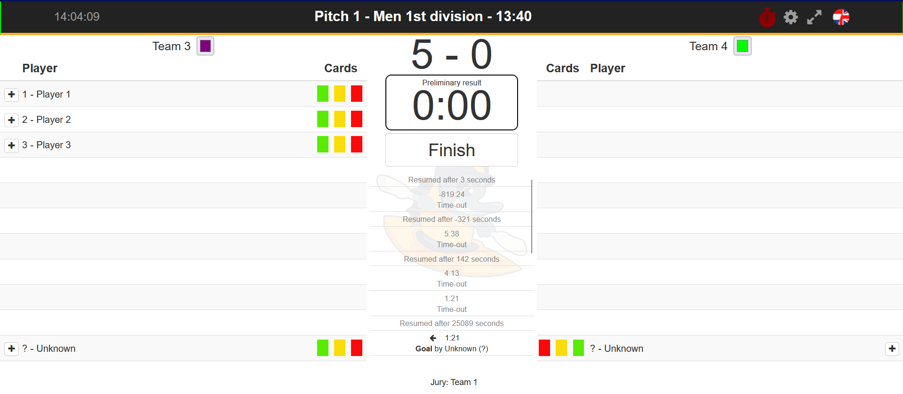

## Browser Extension for Kayakers.nl Cockpit

This code provides a Firefox Browser Extension for the [Kayakers.nl Cockpit](https://cpt.kayakers.nl/cockpit) to control the scoreboard from [hansu/rpi-canoepolo-scoreboard](https://github.com/hansu/rpi-canoepolo-scoreboard) with the cockpit.
Updates from the time, shotclock, score and team-color in the cockpit are sent to the scoreboard via a websocket.

### Set-up:

- Firefox Version 128.0 or higher is required
- enable `network.websocket.allowInsecureFromHTTPS` under `about:config`

#### Install for one-time use

- only for one Firefox session
- load extension into browser in `about:debugging` &rarr; this Firefox &rarr; Load Temporary Add-on

#### Install permanently

- as this is an unsigned extension, it can not be installed through the official Firefox Add-on site
- instead follow the steps described [here](https://support.mozilla.org/en-US/kb/add-on-signing-in-firefox?as=u&utm_source=inproduct#w_what-are-my-options-if-i-want-to-use-an-unsigned-add-on-advanced-users)
- zip this repository to install

